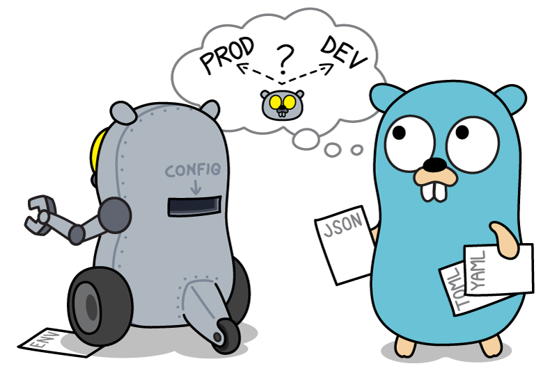

[![godoc for greencoda/confiq][godoc-badge]][godoc-url]
[![Go 1.22][goversion-badge]][goversion-url]
[![Build Status][actions-badge]][actions-url]
[](https://raw.githack.com/wiki/greencoda/confiq/coverage.html)
[![Go Report card][goreportcard-badge]][goreportcard-url]

<p align="center"></p>

# confiq

`confiq` is a Go package for populating structs or arrays from structured data formats such JSON, TOML, YAML or Env, by using struct tags to map the loaded values to fields, using a selector path syntax which can traverse maps by keys and arrays by their indices.

The data can be loaded either from files, strings, byte arrays, readers and in case of environment variable formats from the actual environment.

## Install

```shell
go get -u github.com/greencoda/confiq
```

## Example

Provide the configuration data in a supported format:

**config.json**
``` json
{
    "serverHost": "http://localhost",
    "port": 8000,
    "settings": {
        "readOnlyMode": true,
        "maxConnections": 10,
        "disallowedUsernames": ["badUser1", "badUser2"]
    },
    "apiKeys": [
        "testKey1",
        "testKey2"
    ]
}
```

Create a new configSet using `confiq.New` and load the data with the appropriate Load method, depending on how you'd like to provide it.
In this example we're loading it from the file system:

``` go
configSet := confiq.New()

if err := configSet.LoadJSONFromFile("./config.json"); err != nil {
    log.Fatal(err)
}
```

Define the config struct and provide the mappings in its struct tags for each field.

You may define certain fields to be `required`, or to have a `default` value if it isn't (these are mutually exclusive),
or mark certain fields as `strict` which would cause the entire decoding process to fail if the value can not be set from the provided config data.

``` go
type Config struct {
	ServerHost          *url.URL `cfg:"serverHost,required"`
	ServerPort          string   `cfg:"port"`
	AllowedUsernames    []string `cfg:"settings.allowedUsernames,default=root;admin;developer"`
	DisallowedUsernames []string `cfg:"settings.disallowedUsernames"`
	ReadOnlyMode        bool     `cfg:"settings.readOnlyMode"`
	MaxConnections      int      `cfg:"settings.maxConnections"`
	ClientID            string   `cfg:"settings.clientId,default=defaultClient"`
	APIKey              string   `cfg:"apiKeys[1]"`
}

var config Config
```

Then decode the data to this struct from the loaded config data using `Decode`:

``` go
if err := configSet.Decode(&config); err != nil {
   // ...
}
```

You may also use `StrictDecode` to have all fields act as if they were `strict`:

``` go
if err := configSet.StrictDecode(&config); err != nil {
   // ...
}
```

The result will be an instance of the struct loaded with data from the specified addresses of the config file:
```
(main.Config) {
 ServerHost: (*url.URL)(0xc0000e2090)(http://localhost),
 ServerPort: (string) (len=4) "8000",
 AllowedUsernames: ([]string) (len=3 cap=3) {
  (string) (len=4) "root",
  (string) (len=5) "admin",
  (string) (len=9) "developer"
 },
 DisallowedUsernames: ([]string) (len=2 cap=2) {
  (string) (len=8) "badUser1",
  (string) (len=8) "badUser2"
 },
 ReadOnlyMode: (bool) true,
 MaxConnections: (int) 10,
 ClientID: (string) (len=13) "defaultClient",
 APIKey: (string) (len=8) "testKey2"
}
```

## Supported types:

`confiq` supports recursively decoding values into structs with exported fields, maps and slices.

### Structs
- structs with exported fields of other supported types

### Maps
- maps with primitive types for keys, and other supported types for values

### Slices
- slices of other supported types
- strings will be split up at semicolons, and attempted to be decoded as slices of other supported types

### Primitives
- string
- int, int8, int16, int32, int64
- uint, uint8, uint16, uint32, uint64
- float32, float64
- bool

### Other common types
- json.RawMessage
- net.IP
- time.Duration
- time.Time
- *url.URL

### Custom types
- structs implementing the Decoder interface
- types implementing the encoding.TextUnmarshaler interface

### Pointers
- pointers to supported types are also supported

## Defining decoders for custom structs
For fields with custom struct types, you may implement the Decoder interface by specifying a `Decode` method to your type:

```go
type customType struct {
	Value string
}

func (t *customType) Decode(value any) error {
	if stringValue, ok := value.(string); !ok {
		return errors.New("value is not a string")
	} else {
		t.Value = stringValue

		return nil
	}
}
```

[godoc-badge]: https://pkg.go.dev/badge/github.com/greencoda/confiq
[godoc-url]: https://pkg.go.dev/github.com/greencoda/confiq
[actions-badge]: https://github.com/greencoda/confiq/actions/workflows/test.yml/badge.svg
[actions-url]: https://github.com/greencoda/confiq/actions/workflows/test.yml
[goversion-badge]: https://img.shields.io/badge/Go-1.22-%2300ADD8?logo=go
[goversion-url]: https://golang.org/doc/go1.22
[goreportcard-badge]: https://goreportcard.com/badge/github.com/greencoda/confiq
[goreportcard-url]: https://goreportcard.com/report/github.com/greencoda/confiq
